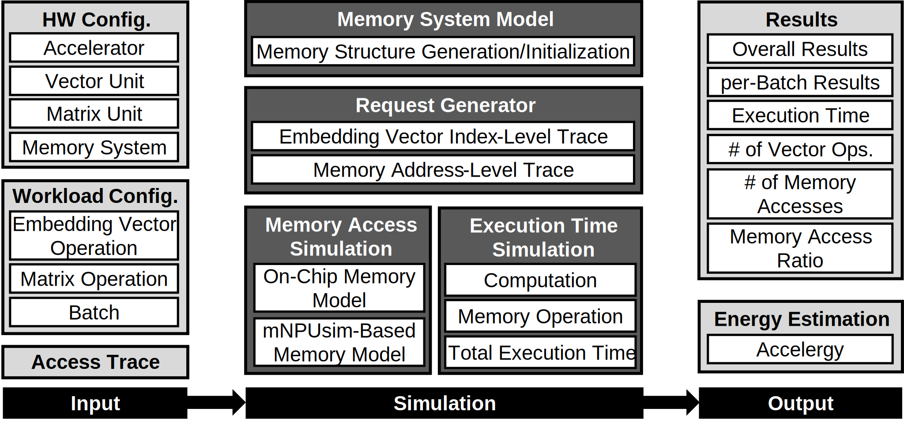

# EONSim \(Ongoing Project)

## Table of Contents
- [Introduction](#introduction)
- [EONSim Overview](#eonsim-overview-working-in-progress)
- [Access Trace Generator](#access-trace-generator)

## Introduction
EONSim is an neural processing unit (NPU) simulator focusing on embedding vector operations.

## EONSim Overview (Working in Progress)
The figure below shows an overview of EONSim.

    

  

### Input
- `Hardware Configuration` 
- `Workload Configuration`
- `Access Trace`

### Simulation
- `Memory System Model`
- `Request Generator`
- `Memory Access Simulation`
- `Execution Time Simulation`

### Output
- `Main Results`
- `Energy Estimation`

## Access Trace Generator
To be added...  