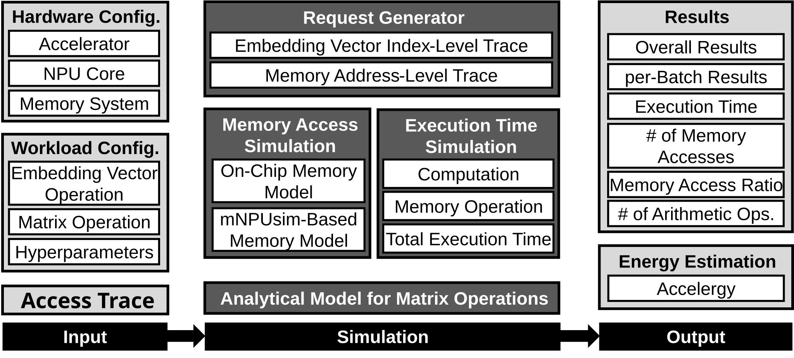

# EONSim

### Note: We are actively refactoring the simulator to enhance the architecture. We will release the stable version with updated documentation shortly!

## Table of Contents
- [Introduction](#introduction)
- [EONSim Overview](#eonsim-overview-work-in-progress)

## Introduction

EONSim is a neural processing unit (NPU) simulator focusing on embedding vector operations and on-chip memory models.


## Quick Start
We provide a Dockerfile to build an experimental environment.

```bash
cd tools/mNPUsim/DRAMsim3 # compile mNPUsim
make libdramsim3.so
cd ..
make
cd ../../scripts
./create_container.sh build # build a docker image
./create_container.sh # create a container
```

Inside the container:

```bash
./run_sim.sh <memory_config> # e.g., cache_LRU
```

You can set other configurations (e.g., hardware, workload, dataset) in the `run_sim.sh` script.
(We will provide a detailed guidline to set other configurations soon.)

## EONSim Overview
The figure below shows an overview of EONSim.

<p align="center">
    
</p>  

### Input
- `Hardware Configuration`: Specifies accelerator-level, per-NPU core, and memory system configurations.
- `Workload Configuration`: Specifies workload configurations including embedding vector operations (e.g., number of embedding tables), matrix operations (e.g., matrix dimensions in each layer), and hyperparameters (e.g., batch size, number of batches).
- `Access Trace`: Hardware-independent, embedding vector-level access trace for embedding vector operation simulation.

### Simulation for Embedding Vector Operation
- `Request Generator`: Generates full access trace using the workload configuration and input access trace, then converts the index-level trace into memory-address level trace.
- `Memory Access Simulation`: EONSim first performs on-chip memory simulation to determine on-chip memory hit/miss, then runs detailed memory access simulation. EONSim employs mNPUsim-based off-chip memory model [Hwang et al., IISWC 2023].
- `Execution Time Simulation`: Along with the memory simulation, EONSim calculates computation time with an analytical model, then determines total execution time for the embedding vector operation.

### Analytical Model for Matrix Operation
We design an analytical model for matrix operations inspired by prior work [Samajdar et al., ISPASS 2020][Park et al., RSP 2023][Zhang et al., ISCA 2024], enabling a fast and accurate simulation for matrix operations.

### Output
- `Main Results`: After the simulation, EONSim outputs the overall results and per-batch results.
- `Energy Estimation`: Optionally, users can run energy estimation based on the energy estimation table obtained from Accelergy [Wu et al., ICCAD 2019].

